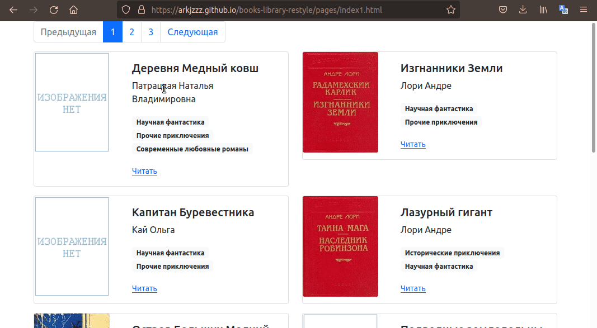

# Books Library Restyle

Проект по обновлению онлайн-библиотеки, состоящий из двух частей: 

1. [Парсеры](#Parcers), с помощью которых можно скачать книги с сайта онлайн-библиотеки [tululu.org](https://tululu.org/): 

    - [`tululu_parser.py`](#tululu_parser) - используется для скачивания отдельных книг
    - [`parse_tululu_category.py`](#parse_tululu_category) - используется для качивания книг жанра "Научная фантастика"

2. [Сайт-библиотека](#Site), который представляет собой интерфейс для скачанных парсерами книг: можно выбрать книгу и сразу начать ее читать.

    Псмотреть как выглядит сайт и потыкать ссылочки можно на демонстрационной странице [Books Library Restyle](https://arkjzzz.github.io/books-library-restyle/pages/index1.html)

## Что используется

- [Библиотека requests](https://dvmn.org/encyclopedia/modules/requests/)
- [BeautifulSoup4](https://beautiful-soup-4.readthedocs.io/)
- [Библиотека pathvalidate](https://github.com/thombashi/pathvalidate)
- [Библиотека argparse](https://docs.python.org/3.6/howto/argparse.html)
- [Библиотека Bootstrap](https://getbootstrap.com/)
- [Шаблонизатор Jinja2](https://jinja2docs.readthedocs.io/en/stable/)
- [LiveReload](https://github.com/lepture/python-livereload)

## Установка

- Клонируйте репозиторий:
```
git clone https://github.com/ArkJzzz/books-library-restyle
```

- Установите зависимости:
```
pip3 install -r requirements.txt
```

## Как пользоваться

### <a name="Parcers"></a> Парсеры 

#### <a name="tululu_parser"></a> tululu_parser.py

- **Скачивание первых 10 книг из онлайн-библиотеки**
```sh
python3 tululu_parser.py
```

Вывод: 

```sh
$ python tululu_parser.py
book id: 1
Административные рынки СССР и России
Книга скачана: books/1. Административные рынки СССР и России.txt
Обложка скачана: images/nopic.gif
book id: 2
HTTPError: Запрашиваемая страница не найдена
book id: 3
Азбука экономики
Книга скачана: books/3. Азбука экономики.txt
Обложка скачана: images/nopic.gif

...

book id: 10
Бизнес путь: Amazon.com
Книга скачана: books/10. Бизнес путь Amazon.com.txt
Обложка скачана: images/10.jpg
```

- **Скачивание произвольного количества книг из онлайн-библиотеки**

```sh
python tululu_parser.py  --start_id 35 --end_id 37
```

Вывод:

```sh
$ python tululu_parser.py  --start_id 35 --end_id 37
book id: 35
Искусство доминировать
Книга скачана: books/35. Искусство доминировать.txt
Обложка скачана: images/35.jpg
book id: 36
Искусство коммуникации в сетевом маркетинге
Книга скачана: books/36. Искусство коммуникации в сетевом маркетинге.txt
Обложка скачана: images/nopic.gif
book id: 37
HTTPError: Запрашиваемая страница не найдена
```

#### <a name="parse_tululu_category"></a> parse_tululu_category.py

- **Скачивание всех доступных книг:**
```sh
python3 parse_tululu_category.py
```

Вывод: 

```sh
$ python3 parse_tululu_category.py
 Всего страниц с книгами жанра: 701
 Ссылки на книги жанра получены
 Получено описание книги Алиби
 Книга скачана: /home/user/books/b0827 Алиби.txt
 Обложка скачана: /home/user/images/b0827 Алиби.jpg
 Получено описание книги Бич небесный
 Книга скачана: /home/user/books/90eda Бич небесный.txt
 Обложка скачана: /home/user/images/90eda Бич небесный.jpg
 Получено описание книги Цена посвящения: Серый Ангел
 Книга скачана: /home/user/books/eea83 Цена посвящения Серый Ангел.txt
 Обложка скачана: /home/user/images/eea83 Цена посвящения Серый Ангел.jpg

 ...

 Получено описание книги Феномен фантастики
 Книга скачана: /home/user/books/01b94 Феномен фантастики.txt
 Обложка скачана: /home/user/images/01b94 Феномен фантастики.jpg
 Описания книг сохранены в файле /home/user/books_description.json
```

- **Указать с какой страницы скачивать:**

```sh
python tululu_parser.py  --start_page 700
```

Вывод:

```sh
$ python3 parse_tululu_category.py --start_page 700
 Ссылки на книги жанра получены
 Получено описание книги Деревня Медный ковш
 Книга скачана: /home/user/books/148d7 Деревня Медный ковш.txt
 Обложка скачана: /home/user/images/148d7 Деревня Медный ковш.gif
 Получено описание книги Двадцать тысяч лье под водой
 Invalid URL: Ссылка не действительна
 Получено описание книги Изгнанники Земли
 Книга скачана: /home/user/books/3abda Изгнанники Земли.txt
 Обложка скачана: /home/user/images/3abda Изгнанники Земли.jpg

 ...

 Получено описание книги Маша
 Книга скачана: /home/user/books/49b96 Маша.txt
 Обложка скачана: /home/user/images/49b96 Маша.gif
 Получено описание книги Феномен фантастики
 Книга скачана: /home/user/books/01b94 Феномен фантастики.txt
 Обложка скачана: /home/user/images/01b94 Феномен фантастики.jpg
 Описания книг сохранены в файле /home/user/books_description.json

```

- **Указать по какую страницу включительно скачивать:**

```sh
python tululu_parser.py  --end_page 2
```

Вывод:

```sh
$ python3 parse_tululu_category.py --end_page 2
 Ссылки на книги жанра получены
 Получено описание книги Алиби
 Книга скачана: /home/user/books/b0827 Алиби.txt
 Обложка скачана: /home/user/images/b0827 Алиби.jpg
 Получено описание книги Бич небесный
 Книга скачана: /home/user/books/90eda Бич небесный.txt
 Обложка скачана: /home/user/images/90eda Бич небесный.jpg
 Получено описание книги Цена посвящения: Серый Ангел
 Книга скачана: /home/user/books/eea83 Цена посвящения Серый Ангел.txt
 Обложка скачана: /home/user/images/eea83 Цена посвящения Серый Ангел.jpg
 
 ...

 Получено описание книги 7-я книга. День Откровения
 Книга скачана: /home/user/books/30dcf 7-я книга. День Откровения.txt
 Обложка скачана: /home/user/images/30dcf 7-я книга. День Откровения.gif
 Получено описание книги 8-я книга. Полет Уригленны.
 Книга скачана: /home/user/books/00b1d 8-я книга. Полет Уригленны.txt
 Обложка скачана: /home/user/images/00b1d 8-я книга. Полет Уригленны.gif
 Описания книг сохранены в файле /home/user/books_description.json

```

- **Указать папку для скачивания книг:**

```sh
python tululu_parser.py  --dest_folder new_folder
```

Вывод:

```sh
$ python3 parse_tululu_category.py --dest_folder new_folder
 Ссылки на книги жанра получены
 Получено описание книги Алиби
 Книга скачана: /home/user/new_folder/books/b0827 Алиби.txt
 Обложка скачана: /home/user/new_folder/images/b0827 Алиби.jpg
 Получено описание книги Бич небесный
 Книга скачана: /home/user/new_folder/books/90eda Бич небесный.txt
 Обложка скачана: /home/user/new_folder/images/90eda Бич небесный.jpg
 Получено описание книги Цена посвящения: Серый Ангел
 Книга скачана: /home/user/new_folder/books/eea83 Цена посвящения Серый Ангел.txt
 Обложка скачана: /home/user/new_folder/images/eea83 Цена посвящения Серый Ангел.jpg

 ...

 Получено описание книги Маша
 Книга скачана: /home/user/new_folder/books/49b96 Маша.txt
 Обложка скачана: /home/user/new_folder/images/49b96 Маша.gif
 Получено описание книги Феномен фантастики
 Книга скачана: /home/user/new_folder/books/01b94 Феномен фантастики.txt
 Обложка скачана: /home/user/new_folder/images/01b94 Феномен фантастики.jpg
 Описания книг сохранены в файле /home/user/new_folder/books_description.json
```

- **Указать свой путь к \*.json файлу с результатами:**

```sh
python tululu_parser.py  --json_path my_books_descriptions.json
```

Вывод:

```sh
$ python3 parse_tululu_category.py --json_path my_books_descriptions.json
 Ссылки на книги жанра получены
 Получено описание книги Алиби
 Книга скачана: /home/user/books/b0827 Алиби.txt
 Обложка скачана: /home/user/images/b0827 Алиби.jpg
 Получено описание книги Бич небесный
 Книга скачана: /home/user/books/90eda Бич небесный.txt
 Обложка скачана: /home/user/images/90eda Бич небесный.jpg
 Получено описание книги Цена посвящения: Серый Ангел
 Книга скачана: /home/user/books/eea83 Цена посвящения Серый Ангел.txt
 Обложка скачана: /home/user/images/eea83 Цена посвящения Серый Ангел.jpg

 ...

 Получено описание книги Маша
 Книга скачана: /home/user/books/49b96 Маша.txt
 Обложка скачана: /home/user/images/49b96 Маша.gif
 Получено описание книги Феномен фантастики
 Книга скачана: /home/user/books/01b94 Феномен фантастики.txt
 Обложка скачана: /home/user/images/01b94 Феномен фантастики.jpg
 Описания книг сохранены в файле /home/user/my_books_descriptions.json
```

- **Пропустить скачивание изображений обложек книг:**

```sh
python tululu_parser.py  --skip_img
```

Вывод:

```sh
$ python3 parse_tululu_category.py --skip_img
 Ссылки на книги жанра получены
 Получено описание книги Алиби
 Книга скачана: /home/user/books/b0827 Алиби.txt
 Получено описание книги Бич небесный
 Книга скачана: /home/user/books/90eda Бич небесный.txt
 Получено описание книги Цена посвящения: Серый Ангел
 Книга скачана: /home/user/books/eea83 Цена посвящения Серый Ангел.txt

 ...

 Получено описание книги Маша
 Книга скачана: /home/user/books/49b96 Маша.txt
 Получено описание книги Феномен фантастики
 Книга скачана: /home/user/books/01b94 Феномен фантастики.txt
 Описания книг сохранены в файле /home/user/books_descriptions.json
```

- **Пропустить скачивание файлов текста книг:**

```sh
python tululu_parser.py  --skip_txt
```

Вывод:

```sh
$ python3 parse_tululu_category.py --skip_txt
 Ссылки на книги жанра получены
 Получено описание книги Алиби
 Обложка скачана: /home/user/images/b0827 Алиби.jpg
 Получено описание книги Бич небесный
 Обложка скачана: /home/user/images/90eda Бич небесный.jpg
 Получено описание книги Цена посвящения: Серый Ангел
 Обложка скачана: /home/user/images/eea83 Цена посвящения Серый Ангел.jpg

 ...

 Получено описание книги Маша
 Обложка скачана: /home/user/images/49b96 Маша.gif
 Получено описание книги Феномен фантастики
 Обложка скачана: /home/user/images/01b94 Феномен фантастики.jpg
 Описания книг сохранены в файле /home/user/books_descriptions.json
```


### <a name="Site"></a> Сайт онлайн-библиотеки

- **Запуск оффлайн версии сайта у себя на компьютере:**

```sh
python render_website.py
```

Вывод:

```sh
python render_website.py 
[I 211214 22:45:30 server:335] Serving on http://127.0.0.1:5500
[I 211214 22:45:30 handlers:62] Start watching changes
[I 211214 22:45:30 handlers:64] Start detecting changes
[I 211214 22:45:32 handlers:135] Browser Connected: http://127.0.0.1:5500/
```

После этого переходите по ссылке [http://127.0.0.1:5500](http://127.0.0.1:5500), вы увидите главную страницу:




- **Так же Вы можете опубликовать сайт на [GitHub Pages](https://pages.github.com)**

Как это сделать, можно почитать в статье [Как создать бесплатный сайт на GitHub Pages](https://medium.com/nuances-of-programming/%D0%BA%D0%B0%D0%BA-%D1%81%D0%BE%D0%B7%D0%B4%D0%B0%D1%82%D1%8C-%D0%B1%D0%B5%D1%81%D0%BF%D0%BB%D0%B0%D1%82%D0%BD%D1%8B%D0%B9-%D1%81%D0%B0%D0%B9%D1%82-%D0%BD%D0%B0-github-pages-e0f3c258ee22)


## Цели проекта

Код написан в учебных целях — это урок в курсе по Python и веб-разработке на сайте [Devman](https://dvmn.org).